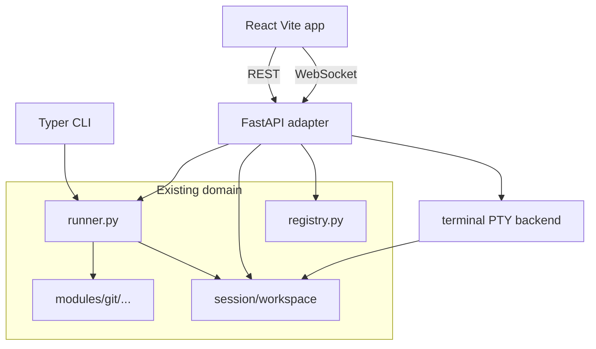
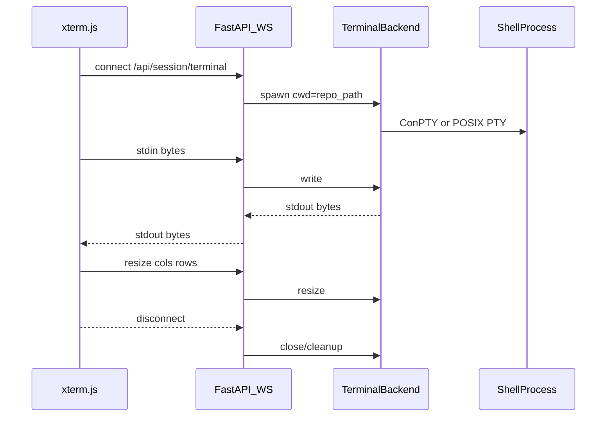

# Praxis Local Web GUI — Architecture Plan

## Verdict

The proposed architecture is appropriate for the product goal (local IDE/lab feel with real Git in a real shell).

**Chosen stack:** FastAPI (localhost-only) + React/TypeScript/Vite frontend with Monaco and xterm.js, adapting the existing `runner` / session / workspace / scenario domain. Keep the Typer CLI. Soft-deprecate Textual now; remove it in the final polish milestone.

PySide6 is a credible alternative for a single-process desktop feel, but Monaco + xterm.js + ConPTY integration are far more mature in the browser ecosystem, and you already want an “IDE-like” layout. Electron/Tauri would add packaging weight without benefit for a local-only MVP. Streamlit/NiceGUI cannot host a real PTY + Monaco cleanly.



---

## Critical design decisions (locked for this plan)

| Topic | Decision |
|---|---|
| Session resolution in the web app | **Active session only** (`state.json` / `load_active_session`). Do **not** reuse CLI cwd hybrid discovery — the server process cwd is not the user’s lab cwd. |
| Bind address | `127.0.0.1` only (no LAN exposure) |
| Launch | `praxis app` starts uvicorn, serves API (+ built static assets when present), opens default browser |
| Textual | Keep `praxis ui` working but mark deprecated; delete package/deps in milestone 5 |
| Terminal | Real PTY/ConPTY, one session tied to active exercise repo; thin platform abstraction |
| Auth / DB / multi-user | Out of scope indefinitely for this plan |

### Local application security boundary

Binding to `127.0.0.1` is **required but not sufficient**, especially once file writes and a PTY exist.

Constraints from the beginning:

* bind only to `127.0.0.1`
* enforce trusted/expected `Host` headers
* validate request `Origin` where appropriate
* strictly validate WebSocket `Origin` before accepting terminal connections (M4)
* do **not** enable wildcard CORS
* never accept a client-supplied repository root or terminal cwd
* derive workspace/repository paths exclusively from the server-side active Praxis session
* preserve path containment and symlink escape protections
* random **per-launch capability token** passed to the browser and required by privileged API/WS operations (local process authorization — not user accounts)

**Dev:** Vite proxies `/api` and `/ws` so the FE is same-origin to the Vite host without broad CORS.

**`praxis app`:** FastAPI serves the compiled Vite frontend so app, API, and WS share one localhost origin.

No authentication system, user accounts, TLS setup, or security framework.

---

## Alternatives considered (brief)

1. **Browser + FastAPI (chosen)** — Best fit for Monaco/xterm; clear adapter boundary; slightly more tooling (Node + Python).
2. **PySide6 native** — Fewer runtime pieces; weaker editor/terminal ecosystem; larger desktop-app surface for little gain while the product is still evolving.
3. **Electron/Tauri shell around React** — Packaging complexity; unnecessary while “open localhost in browser” is enough.

---

## Package / repo structure

```text
Praxis/
├── src/praxis/
│   ├── runner.py              # unchanged contract; sole orchestration
│   ├── registry.py
│   ├── session.py / workspace.py / ...
│   ├── cli.py                 # + `praxis app`; deprecate `ui`
│   ├── api/                   # NEW — thin HTTP/WS adapter only
│   │   ├── __init__.py
│   │   ├── app.py             # FastAPI factory
│   │   ├── deps.py            # active session resolution helpers
│   │   ├── errors.py          # map PraxisError -> HTTP
│   │   ├── schemas.py         # response/request models
│   │   ├── routes/
│   │   │   ├── catalog.py
│   │   │   ├── session.py
│   │   │   └── files.py
│   │   └── terminal_ws.py     # WebSocket endpoint
│   ├── terminal/              # NEW — PTY abstraction (not Git/domain)
│   │   ├── __init__.py
│   │   ├── base.py            # Protocol: spawn/read/write/resize/close
│   │   ├── posix.py
│   │   └── windows.py         # ConPTY via pywinpty
│   └── ui/                    # Textual — deprecated; remove in M5
└── frontend/                  # NEW
    ├── package.json
    ├── vite.config.ts
    ├── index.html
    └── src/
        ├── main.tsx
        ├── App.tsx
        ├── api/client.ts
        ├── views/HomeView.tsx
        ├── views/SessionView.tsx
        ├── components/ObjectivesPanel.tsx
        ├── components/FileTree.tsx
        ├── components/Editor.tsx
        └── terminal/Terminal.tsx
```

No second business layer in FastAPI: route handlers call `bootstrap_registry()`, `runner.*`, and small file/PTY helpers.

---

## API boundaries

Prefer a compact resource model over many micro-endpoints.

| Method | Path | Behavior |
|---|---|---|
| `GET` | `/api/health` | liveness |
| `GET` | `/api/catalog` | `{ modules: [{ id, scenarios: [{ id, title }] }] }` from registry (no Git-specific FE knowledge) |
| `GET` | `/api/session` | active session or `404`; include assignment + last known check optional (`null` until checked) |
| `POST` | `/api/session/start` | body `{ module, scenario }` → `runner.start` → session + assignment |
| `POST` | `/api/session/check` | `runner.check` (active session) → `CheckResult` |
| `POST` | `/api/session/reset` | `runner.reset` → assignment + fresh check |
| `GET` | `/api/session/fs/tree` | recursive listing under exercise `repo/` (relative paths only) |
| `GET` | `/api/session/fs/file` | query `path` → text content (+ encoding note); reject binaries early |
| `PUT` | `/api/session/fs/file` | body `{ path, content }` → write inside repo |
| `WS` | `/api/session/terminal` | bidirectional PTY bytes + resize control messages |

Error mapping: `PraxisError` → JSON `{ detail, code }` with HTTP 404/409/400/500 as appropriate; never leak host paths outside the workspace in messages when avoidable.

**Not in MVP API:** multi-session list/select, hints, Git RPC, filesystem watch events, auth.

---

## Reusing existing domain

| GUI need | Existing entrypoint |
|---|---|
| List scenarios | `bootstrap_registry` + `list_registered_scenarios` + `get_scenario(...).title` |
| Start | `runner.start(module, scenario)` |
| Check | `runner.check()` — web must not rely on process cwd |
| Reset | `runner.reset()` same constraint |
| Assignment | returned by start/reset; or `get_scenario(...).assignment()` |
| Paths | `Session.repo_path` / `workspace_path` from persisted session |

**Small domain tweak (allowed):** extend runner with helpers that **only** use the active session for app/API callers (e.g. resolve via `load_active_session()`), keeping CLI hybrid discovery unchanged.

File I/O lives in `api` or a tiny `praxis/fs.py` helper using pathlib containment — **not** in scenarios.

---

## File access security

All file operations:

1. Load active session; take `repo_path.resolve()`.
2. Join client-relative path; reject absolute paths and empty/`Path` tricks.
3. `resolved = (repo / rel).resolve()`.
4. Require `resolved.is_relative_to(repo)`.
5. Reject if any intervening symlink escapes (resolve + containment); refuse writing through symlink that points outside.
6. Optional MVP limits: max file size (e.g. 1–2 MiB); text-only (reject NUL bytes).
7. Never accept host absolute paths from the client.

Reuse/extend `assert_safe_repo_path` patterns; add `resolve_repo_relative(repo, rel) -> Path`.

---

## Terminal / PTY architecture



**Abstraction** (`praxis/terminal/base.py`):

```python
class TerminalBackend(Protocol):
    def spawn(self, cwd: Path, argv: list[str] | None = None) -> None: ...
    def write(self, data: bytes) -> None: ...
    def read(self, n: int = 4096) -> bytes: ...
    def resize(self, cols: int, rows: int) -> None: ...
    def close(self) -> None: ...
```

- **POSIX:** `pty.openpty` + asyncio read/write.
- **Windows:** **pywinpty** (ConPTY).
- Shell argv: share policy with current shell helper (`PRAXIS_SHELL`, pwsh/powershell/cmd, `$SHELL`) via `praxis/terminal/shell_cmd.py`.
- **Security:** spawn only with active session; cwd forced to that session’s `repo_path`; no client-supplied cwd; tear down on WS disconnect; one terminal per WS connection (MVP).
- **Protocol:** binary WebSocket frames for PTY data + JSON text frames for `{type:"resize", cols, rows}`.

Do not use a “run one command” RPC. Do not embed terminal emulators in Python.

---

## Frontend UX (first complete GUI)

**Home:** catalog from `/api/catalog`; Start → `/api/session/start` → navigate to session view.

**Session layout (IDE-like, single page):**

- Left/top: title, assignment, objectives (PASS/FAIL), Check / Reset / New Exercise, session id
- Center: file tree + Monaco editor (dirty indicator, Save)
- Bottom or right: xterm.js attached to WS terminal

No Merge/Commit/Resolve buttons. Check calls API; Reset calls API then refreshes tree/editor/objectives/terminal (reconnect PTY after reset because repo tree was wiped).

---

## Dev / build / launch workflow

**Dev:**

```bash
# terminal A
uv sync
uv run praxis app --reload          # API on 127.0.0.1:8765

# terminal B
cd frontend && npm install && npm run dev   # Vite proxies /api to 8765
```

**Integrated:**

```bash
cd frontend && npm run build
uv run praxis app                   # serves frontend/dist + API; opens browser
```

`praxis app` responsibilities: `bootstrap_registry()`, create FastAPI app, uvicorn bind `127.0.0.1:8765`, optional `webbrowser.open`, mount static files if `frontend/dist` exists.

Node is a **frontend toolchain** only.

---

## Dependencies to add (justified)

**Python**

| Package | Why |
|---|---|
| `fastapi` | Typed HTTP/WS adapter |
| `uvicorn[standard]` | Local ASGI server |
| `pywinpty` | Windows ConPTY (Windows-oriented extra if practical) |

**Not added:** SQLAlchemy, auth libs, Redis, Celery, Docker SDKs, GraphQL, Django.

**Frontend**

| Package | Why |
|---|---|
| `react` / `react-dom` / `typescript` / `vite` | App shell |
| `monaco-editor` | File editing |
| `@xterm/xterm` + `@xterm/addon-fit` | Real terminal UI |

Skip Redux; React context or minimal state is enough.

**Remove later (M5):** `textual`, `praxis.ui`, `praxis ui` command, related tests.

---

## Testing strategy

| Layer | Approach |
|---|---|
| Domain | Existing pytest suite remains authoritative |
| API | `TestClient` + temp `PRAXIS_HOME`: catalog, start/check/reset, 404 without session |
| Files | Traversal (`../`, absolute), symlink escape, happy-path read/write |
| Terminal unit | Fake backend asserting spawn cwd + close on disconnect |
| Terminal integration | Optional platform-marked smoke tests — not required to block M1–M3 |
| Frontend | Vitest for catalog/objectives mapping; no mandatory Playwright for MVP |
| CLI | Existing CliRunner tests stay green |

---

## Milestones (reviewable; risk-ordered)

### M1 — FastAPI adapter + read-only session dashboard
- `praxis.api` with health, catalog, session start/check/reset
- Minimal React shell: assignment + objectives after check; Check button
- `praxis app` launches API (and minimal FE)
- Active-session resolution for API/app
- Textual: deprecation message only on `praxis ui`

### M2 — Home / start flow
- Home view from catalog
- Start exercise → session view
- New Exercise returns home

### M3 — File tree + Monaco
- Secure FS helpers + tree/file GET/PUT
- Dirty/save/refresh
- After Reset: reload tree and close dirty buffers

### M4 — xterm.js + PTY
- `praxis.terminal` backends + WS endpoint
- Embed terminal; reconnect after Reset
- Lifecycle/cleanup tests with fake backend

### M5 — UX polish + Textual cleanup
- Layout polish, error toasts, bind-host safety, README for `praxis app`
- Remove Textual package, dependency, tests, `ui` command

**Why this order:** API + session feedback proves the adapter before editor/PTY complexity. Terminal last isolates ConPTY risk.

---

## Overengineering to avoid

- Plugin systems, DI containers, Clean Architecture folders inside `api/`
- OpenAPI-generated full FE SDK (handwritten `api/client.ts` is enough)
- Redux, heavy router ceremony
- LSP, debug adapters, Git GUI, file watchers, multi-tab terminal farm
- Auth, HTTPS reverse proxies, Docker Compose for MVP
- Reimplementing validation in TypeScript
- Keeping two GUIs long-term

---

## Textual recommendation

**Retain temporarily** through M1–M4 as a fallback while the web GUI is incomplete; **do not extend it**. Remove in **M5**.

---

## Open product note (non-blocking)

After Reset, the PTY must be restarted (repo directory recreated). The UI should show a clear “terminal reconnecting” state rather than a dead xterm buffer.
